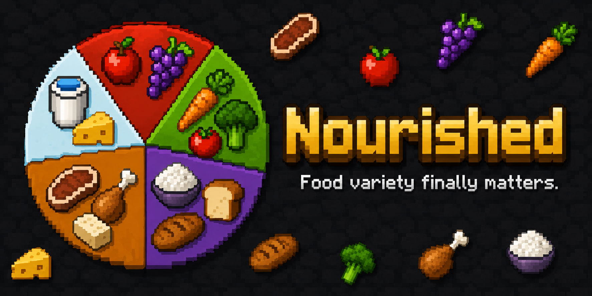

[](LICENSE) [](https://github.com/kgbcupcake/nourished/releases) [](https://github.com/kgbcupcake/nourished/stargazers) [](https://github.com/kgbcupcake/nourished/issues) [](https://www.minecraft.net) [](https://neoforged.net) [](https://deepwiki.com/kgbcupcake/nourished)



> "I got sick of Minecraft's food system. There are other nutrition mods out there,
> but none of them did what I wanted or were updated for modern Minecraft,
> so I decided to build my own."

---

## The HUD


> The HUD is the heart of the mod. Five color-coded bars sit on screen while you play;you always know where you stand without opening a menu.

HUD Edit Mode

**Drag it anywhere.** Press the keybind to enter edit mode and reposition the HUD exactly where you want it. Scale it, anchor it to any corner, or hide bars that are at zero.

---

## The Diet Screen


> Open it from your inventory for a full breakdown - trend arrows, balance score, active effects, calorie tracking, and a reset timer coming in soon.

> Note: The HUD and Diet Screen screenshots were taken using the PureBDCraft resource pack. The UI is fully functional on vanilla textures but will appear in the default Minecraft style without a resource pack installed.

---

## Modularity

Every feature in Nourished is a module toggle. Turn off decay, effects, the HUD, toasts, calorie tracking, or the diet screen independently. Modpack authors can lock modules server-side.

## Community

Discord: [[https://discord.gg/EZnFJsfQup]](https://discord.gg/EZnFJsfQup])
Questions, suggestions, and development discussion are welcome.

## Features

❤️ **What you gain**: when all five food groups are above 75%:

- Health Boost I:  passive while balanced
- Regeneration I:  passive while balanced

| Group | Neglect Penalty | Balance Buff |
|---|---|---|
| 🌾 Grains | Weakness I | ✓ |
| 🥦 Vegetables | Slowness I | ✓ |
| 🥩 Proteins | Mining Fatigue I | ✓ |
| 🍎 Fruits | Unluck I | ✓ |
| 🍬 Sugars | — | — |
| 🥛 Dairy | — | ✓ |

Sugars and Dairy have no penalty effect by default: both are tracked and affect your balance score, but only Dairy counts toward the balance buff. Configurable.

## 🍽️ Eating at full hunger

Vanilla blocks eating at full hunger; Nourished still counts nutrition when your hunger bar is full. Light foods (berries, fruits, snacks) can be eaten for nutrients without restoring hunger. Heavy meals follow vanilla rules by default. Both configurable: `blockHeavyMeals` and `blockLightFood`.

Diminishing returns apply:  eating the same food repeatedly gives less credit each time, encouraging real variety.

---

<details>
<summary>🥩 Raw Food & Gut Health</summary>

Eating raw or undercooked food has consequences. Nourished tracks a **gut health** value per player that degrades when you eat raw food and recovers over time from cooked food and dietary variety.

Raw foods classify into four tiers:

| Tier | Effect |
|---|---|
| Fine | No penalty |
| Mild | Minor debuff, short duration |
| Medium | Moderate debuff, longer duration |
| Severe | Strong debuff, extended duration |

Eating the same raw food repeatedly within a memory window increases sensitivity, the more you do it, the worse the penalty gets. Gut health recovers passively, faster with cooked food and dietary diversity. Resistance builds up over time, reducing penalty scale.

Everything — tiers, durations, nutrient penalties, recovery rates:  is configurable via `config/nourished/raw_food.json` and server module toggles. This is currently the only true gameplay module beyond core nutrition tracking (Stamina, mentioned in older docs, is a compat integration with the separate Peak Stamina mod, not a native Nourished module).

</details>

## 🔧 Configurable to your server

Everything ships with sensible defaults. Everything can be changed:

- Toggle individual modules on or off
- Adjust decay rates and thresholds per nutrient
- Add, remove, or replace effects via `effects.json`
- Override anything through datapacks: no file editing needed
- Control eating behavior with `blockHeavyMeals` and `blockLightFood`
- Save and share full config snapshots with a single share code

---

## 🤝 Broad mod compatibility

If a mod adds food with `FoodProperties`, Nourished handles it automatically, no data files to write, no configs to edit. On top of that, 30+ mods have dedicated compat entries for tighter integration:

**Delight-family & source mods:** Farmer's Delight, Ars Flavors Delight, Autochef's Delight, Cataclysm Delight, Create: Food, Croptopia, Croptopia Delight, Farmer's Croptopia, Ender's Delight, Ends Delight, Expanded Delight, Let's Do Bakery/Brewery/Herbal Brews, More Delight, Naturalist, Ocean's Delight, Pam's HarvestCraft 2 (core, crops, extended, trees), Spice of Life: Onion

**Farming & seasons:** Botany Pots, Crop Critters, Ecliptic Seasons, Farming for Blockheads, Serene Seasons, Mama's Herbs

**Survival overhaul:** Cold Sweat, Legendary Survival Overhaul ⚠️ *(effects disabled — LSO takes priority)*, Tough as Nails

**Other integrations:**

| Mod | Status |
|---|---|
| KubeJS | ✅ Full scripting support |
| Peak Stamina | ✅ Nutrition affects stamina |
| JEI / REI / EMI | ✅ Tooltips in recipe viewers |
| Any mod with `FoodProperties` | ✅ Auto-classified |

---

## 🌐 For mod developers

Nourished runs on [MariesLib](https://github.com/kgbcupcake/MariesLib): install both mods. `NourishedAPI` is a thin, stable facade over the library:

```java
float level = NourishedAPI.getValueLevel(player, "proteins");
NourishedAPI.registerValue(definition);
NourishedAPI.registerSourceClassification(foodId, "proteins", 0.15f);
```

See [API.md](API.md) for the full reference, verified directly against source. Datapack-only integrations need no Java at all.

---

## 📦 Datapack support

Everything in Nourished can be driven by datapacks with zero Java code:

- **Nutrients**:  define custom food groups
- **Food classification**:  assign items to nutrient bars via item tags under `data/nourished/tags/item/nutrients/`
- **Effects**:  add or replace buff/debuff rules via `effects.json`
- **Food overrides**:  override specific item nutrition values via `food_overrides.json`
- **Excluded items**:  fully exclude specific items from tracking via `excluded_items.json`
- **Colors**:  customize HUD bar colors via `colors.json`

The built-in food scanner (MariesLib tooling, `/nourished scan`) auto-classifies unknown foods and can write datapack output into your save. See [API.md](API.md).

For contributing new food-classification coverage to `scanner_spec.json` itself, see [CONTRIBUTING.md](CONTRIBUTING.md).

---

## 🟨 KubeJS support

Scripting support for nutrient events, food classifications, and diet hooks: no Java required.

```js
NourishedEvents.nutrientChanged(event => {
    if (event.valueKey === 'proteins' && event.newValue < 0.25) {
        event.player.tell('Eat some protein!')
    }
})
```

See [API.md](API.md#kubejs) for the full event list.

---

## ⚙️ Requirements

|  |  |
|---|---|
| **Minecraft** | 1.21.1 |
| **NeoForge** | 21.1.x |
| **MariesLib** | **0.1.1-beta.5+** (hard dependency — install alongside this mod) |
| **Cloth Config** | required at runtime |
| **Patchouli** | optional (in-game guide) |
| **Java** | 21 |

---

## License

MIT

## Links

- [Modrinth](https://modrinth.com/mod/nourished)
- [MariesLib](https://github.com/kgbcupcake/MariesLib) (required dependency)
- [Contributing](CONTRIBUTING.md)
- [API.md](API.md)
- [Changelog](CHANGELOG.md)
