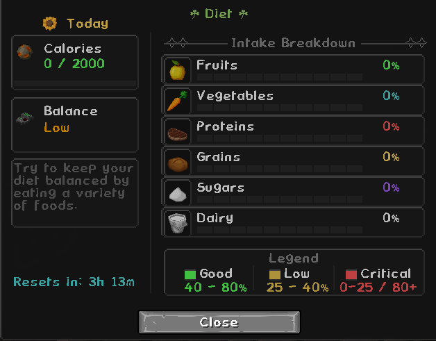
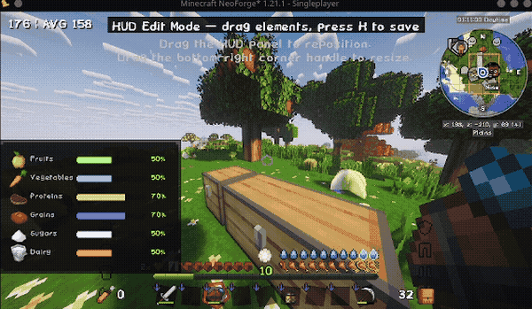
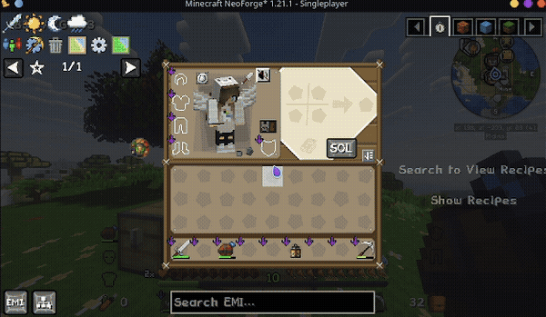

🌿 Nourished — Food variety finally matters.

I got sick of Minecraft's food system. There are other nutrition mods out there, but none of them did what I wanted or were updated for modern Minecraft, so I decided to build my own.




---


❤️ What you gain
When you have all six food groups are above 75%, you get:

Health Boost I — passively while balanced
Regeneration I — passively while balanced

When all six food groups are above 75%, you get:

| Group | Neglect Penalty |
|---|---|
| 🌾 Grains | Weakness I |
| 🥦 Vegetables | Slowness I |
| 🥩 Proteins | Mining Fatigue I |
| 🍎 Fruits | Unluck I |
| 🍬 Sugars | — |
| 🥛 Dairy | — |

---

## 🍽️ Eating at full hunger

Even at full vanilla hunger, light foods can still be eaten for nutrition — berries, fruits, and snacks contribute to your nutrient bars without restoring hunger. Heavy meals follow vanilla rules by default.

Both behaviors are configurable: `blockHeavyMeals` and `blockLightFood` toggles give server admins full control.

All effects are fully configurable and can be disabled per-module.

Diminishing returns apply - eating the same food repeatedly gives less credit each time, encouraging real variety.

Sugars and Dairy have no penalty effect by default — these groups are tracked and affect your balance score but do not apply a debuff when depleted. This is configurable.

---

## 🍽️ Eating at full hunger

Vanilla hunger prevents eating at full hunger, so Nourished allows foods to still provide nutrition even when your hunger bar is full.

Both behaviors are configurable: `blockHeavyMeals` and `blockLightFood` toggles give server admins full control.

---


## The HUD

The HUD is the heart of the mod. Six color-coded bars sit on screen while you play - you always know where you stand without opening a menu.



Note: The HUD and Diet Screen screenshots were taken using the PureBDCraft resource pack. The UI is fully functional on vanilla textures but will appear in the default Minecraft style without a resource pack installed.

**Drag it anywhere.** Press the keybind to enter edit mode and reposition the HUD exactly where you want it. Scale it, anchor it to any corner, or hide bars that are at zero.

---

## The Diet Screen

Open it from your inventory for a full breakdown - trend arrows, balance score, active effects, calorie tracking, and a reset timer.



Note: The HUD and Diet Screen screenshots were taken using the PureBDCraft resource pack. The UI is fully functional on vanilla textures but will appear in the default Minecraft style without a resource pack installed.

---

## Modularity

Every feature in Nourished is a module toggle. Turn off decay, effects, the HUD, toasts, calorie tracking, or the diet screen independently. Modpack authors can lock modules server-side.

## 🔧 Configurable to your server

Everything ships with sensible defaults. Everything can be changed:

- Toggle individual modules on or off
- Adjust decay rates and thresholds per nutrient
- Add, remove, or replace effects via `effects.json`
- Override anything through datapacks — no file editing needed
- Control eating behavior with `blockHeavyMeals` and `blockLightFood` toggles
- Save and share full config snapshots with a single share code
  
---

## 🤝 Broad Mod Compatibility

If a mod adds food with `FoodProperties`, Nourished handles it automatically. No data files to write, no configs to edit.

| Mod | Status |
|-----|--------|
| Farmer's Delight | ✅ Full |
| Pam's HarvestCraft 2 | ✅ Full |
| Create: Food | ✅ Full |
| Croptopia | ✅ Full |
| Farmer's Croptopia | ✅ Full |
| Croptopia Delight | ✅ Full |
| Farm & Charm | ✅ Full |
| Ender's Delight | ✅ Full |
| L_Ender's Delight | ✅ Full |
| Ars Delight | ✅ Full |
| Autochef's Delight | ✅ Full |
| Spice of Life: Onion | ✅ Full |
| KubeJS | ✅ Full scripting support |
| Peak Stamina | ✅ Nutrition affects stamina |
| JEI / REI / EMI | ✅ Tooltips in recipe viewers |
| Legendary Survival Overhaul | ⚠️ Effects disabled (LSO takes priority) |
| Any mod with FoodProperties | ✅ Auto-classified |

---

## 🌐 For mod developers

Nourished ships a stable public API if you want to integrate with it:

```java
float level = NourishedAPI.getNutrientLevel(player, "proteins");
NourishedAPI.registerNutrient(definition);
NourishedAPI.registerFoodClassification(foodId, "proteins", 0.15f);
```

API elements are marked `@Stable`, `@Experimental`, or `@Internal` so you know exactly what you can rely on.


Read [`API.md`](API.md) for the full public API and [`PHILOSOPHY.md`](PHILOSOPHY.md) for compatibility and stability guarantees. Addons can register custom nutrients, food classifications, and diet events through Java or KubeJS, and can also ship datapack-only integrations without writing Java code. See the example addon project for a minimal end-to-end integration pattern.

---

## 📦 Datapack Support
Everything in Nourished can be driven by datapacks with zero Java code:

Nutrients — define custom food groups
Food classification — assign items to nutrient bars via item tags under data/nourished/tags/item/nutrients/
Effects — add or replace buff/debuff rules via effects.json
Food overrides — override specific item nutrition values via food_overrides.json
Food values — adjust category multipliers via food_values.json
Colors — customize HUD bar colors via colors.json
The built-in Food Scanner tool auto-classifies unknown foods and can write a ready-to-use datapack directly into your save with one click.see [`API.md`](API.md).

---

## 🟨 KubeJS Support

Full KubeJS scripting support for custom nutrient events, food classifications, and diet hooks — no Java required.

```js
NourishedEvents.onNutrientChanged(event => {
    if (event.nutrient === 'proteins' && event.level < 0.25) {
        event.player.tell('Eat some protein!')
    }
})
```

---

## 🚧 Current Focus

- Balancing nutrient decay
- Expanding datapack support
- Improving multiplayer syncing
- Additional compat integrations
- More HUD customization

---

## Requirements

- Minecraft **1.21.1**
- NeoForge **21.1.x**
- Java **21**

---

## License

MIT

## Links
- [Modrinth](https://modrinth.com/mod/nourished)
- [API.md](API.md)
- [PHILOSOPHY.md](PHILOSOPHY.md)
- [ARCHITECTURE.md](ARCHITECTURE.md)
