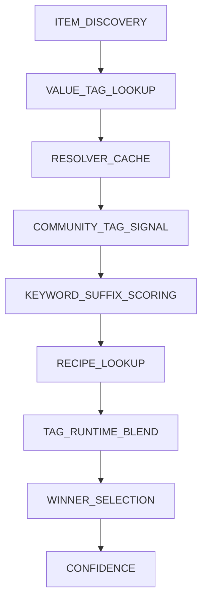

# Classification Pipeline

Every source classification decision in MarieLib is inspectable. This page explains how the pipeline works and how to debug classification results.

---

## 🔍 Pipeline Overview

MarieLib classifies edible items through a multi-stage pipeline. Each stage records a trace step so you can see exactly why an item resolved the way it did.



### Trace Step IDs

| Step | What it checks |
|---|---|
| `ITEM_DISCOVERY` | Item is edible / has food properties |
| `VALUE_TAG_LOOKUP` | Registered value tags on the item |
| `EXTERNAL_CLASSIFICATION` | Compat or API-registered mappings |
| `RESOLVER_CACHE` | Cached prior resolution |
| `COMMUNITY_TAG_SIGNAL` | `c:foods/*` tag matches |
| `KEYWORD_SUFFIX_SCORING` | Item name keyword analysis |
| `RECIPE_LOOKUP` | Recipe ingredient inheritance |
| `INGREDIENT_RESOLUTION` | Per-ingredient classification |
| `NAMESPACE_PEER` | Same-namespace item clustering |
| `PRIMARY_RECIPE_MERGE` | Multi-ingredient recipe merge |
| `TAG_RUNTIME_BLEND` | Tag data blended with runtime inference |
| `SIGNAL_AGGREGATION` | Multiple signals combined |
| `WINNER_SELECTION` | Highest-scoring value key chosen |
| `CONFIDENCE` | Spread-based confidence check |
| `HARD_FALLBACK` | Last-resort classification |
| `APPLY_GATE` | Final apply decision |

---

## ⚖️ Signal Priority

When multiple signals compete, MarieLib uses weighted precedence:

| Signal | Priority |
|---|---|
| Value tags (`modid:values/*` or consumer-specific tags) | Highest |
| Community tags (`c:foods/*`) | 5× |
| Namespace grouping | 4× |
| Name suffix match | 3× |
| Keyword match | 2× |
| Recipe inheritance | 1× |

**Tag vs runtime blend:** When both tag data and runtime inference produce results, tag data typically wins for the dominant value. Runtime results may supplement secondary values.

---

## 🧪 Inspecting Classifications

Hold a classified item and run:

```
/<modId> debug held
```

For Nourished: `/nourished debug held`

This writes a full classification trace to:

```
config/<modId>/debug/trace_dump.txt
```

The trace shows every pipeline stage, scores considered, blend precedence decisions, and the final value assignment.

---

## 📊 Scanner Output

The scanner analyzes all edible items and can write:

- Tag recommendations for `data/<modId>/tags/item/values/<key>.json`
- Multi-value reports for items with secondary classifications
- Overlap matrices showing co-occurrence between value pairs
- Ambiguous item lists for manual review

Run multi-value analysis with:

```
/<modId> scan_analysis
```

Output lands in `config/<modId>/scanner_analysis/`.

---

## 💡 Tips

- Items with `c:foods/*` tags classify reliably — add them if you're a mod author.
- Recipe inheritance means complex foods inherit from ingredients (e.g. stew → multiple values).
- Low-confidence items appear in `config/<modId>/unassigned_sources.txt` via `/get_unassigned`.

---

## 📚 Related Pages

- [Diagnostics & Tracing](Diagnostics-and-Tracing)
- [Community Tags](Community-Tags)
- [Compatibility Guide](Compatibility-Guide)
- [Commands Reference](Commands-Reference)
